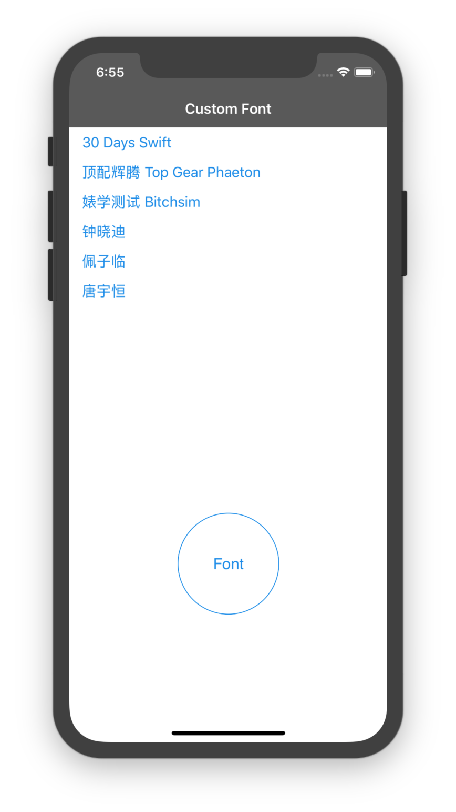

# iOS_CustomFont-master
## 文件结构
```
.
├── .git
│   ├── COMMIT_EDITMSG
│   ├── HEAD
│   ├── branches
│   ├── config
│   ├── description
│   ├── hooks
│   │   ├── README.sample
│   │   ├── applypatch-msg.sample
│   │   ├── commit-msg.sample
│   │   ├── fsmonitor-watchman.sample
│   │   ├── post-update.sample
│   │   ├── pre-applypatch.sample
│   │   ├── pre-commit.sample
│   │   ├── pre-push.sample
│   │   ├── pre-rebase.sample
│   │   ├── pre-receive.sample
│   │   ├── prepare-commit-msg.sample
│   │   └── update.sample
│   ├── index
│   ├── info
│   │   └── exclude
│   ├── logs
│   │   ├── HEAD
│   │   └── refs
│   │       └── heads
│   │           └── master
│   ├── objects
│   │   ├── 03
:   :   :
│   │   ├── f8
│   │   │   └── 3f6fd5810b9c852cf98563d82d5ed1e84ff893
│   │   ├── info
│   │   └── pack
│   └── refs
│       ├── heads
│       │   └── master
│       └── tags
├── .idea
│   ├── CustomFont.iml
│   ├── inspectionProfiles
│   │   └── profiles_settings.xml
│   ├── misc.xml
│   ├── modules.xml
│   └── workspace.xml
├── CustomFont
│   ├── AppDelegate.swift
│   ├── Assets.xcassets
│   │   ├── AppIcon.appiconset
│   │   │   └── Contents.json
│   │   └── Contents.json
│   ├── Base.lproj
│   │   ├── LaunchScreen.storyboard
│   │   └── Main.storyboard
│   ├── Gaspar\ Regular.otf
│   ├── Info.plist
│   ├── MFJinHei_Noncommercial-Regular.ttf
│   ├── MFTongXin_Noncommercial-Regular.ttf
│   ├── MFZhiHei_Noncommercial-Regular.ttf
│   └── ViewController.swift
├── CustomFont.xcodeproj
│   ├── project.pbxproj
│   ├── project.xcworkspace
│   │   ├── contents.xcworkspacedata
│   │   ├── xcshareddata
│   │   │   └── IDEWorkspaceChecks.plist
│   │   └── xcuserdata
│   │       └── lightwingng.xcuserdatad
│   │           └── UserInterfaceState.xcuserstate
│   └── xcuserdata
│       └── lightwingng.xcuserdatad
│           └── xcschemes
│               └── xcschememanagement.plist
├── Gaspar\ Regular.otf
├── MFJinHei_Noncommercial-Regular.ttf
├── MFTongXin_Noncommercial-Regular.ttf
├── MFZhiHei_Noncommercial-Regular.ttf
├── README.md
└── CustomFont.png
```
## 运行效果(iPhone X)

<center>Custom Font on run</center>

